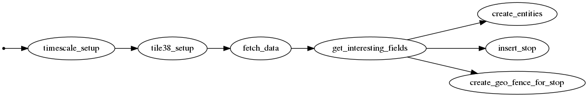
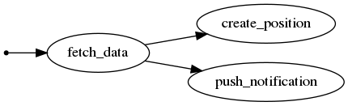

# Irigo-ETL

Simple [ETL](https://en.wikipedia.org/wiki/Extract,_transform,_load) exercise.

It loads [open datas exposed by the french town of Angers](https://data.angers.fr).

## Datasets used

- [Buses and stops](https://data.angers.fr/explore/dataset/bus-tram-topologie-dessertes/information/),
- [Real-time position of buses and tramways](https://data.angers.fr/explore/dataset/bus-tram-position-tr/information/)

## Components

The project a simple architecture :

- [Nginx](https://www.nginx.com/) as a server,
- a websocket server built with [Socket.io](https://socket.io/),
- [Redis]() as in-memory datasource for the websocket,
- [TimscaleDB](https://www.timescale.com/) a time-series database built on top of [PostgreSQL](https://www.postgresql.org/),
- [PipelineDB](https://www.pipelinedb.com/) an alternatif to TimescaleDB,
- [Tile38](https://tile38.com/) a Redis-based service for managing geofencing.

## Requirements

- Python 3.6.x
- Docker & Docker-compose

## Use it

```sh
cd irigo-etl/
docker-compose up -d
python -m venv irigo
source bin/activate
pip install -r requirements.txt
python src/main.py
python src/realtime.py
```

Open the [websocket](http://localhost:3000/) page to see the updates

You can also view the logs from the websocket-server :
```sh
docker-compose logs -f websocket-server
``` 

## Generate Bonobo's graphs

```sh
bonobo inspect --graph src/main.py | dot -o main.png -T png
bonobo inspect --graph src/realtime.py | dot -o realtime.png -T png
```



